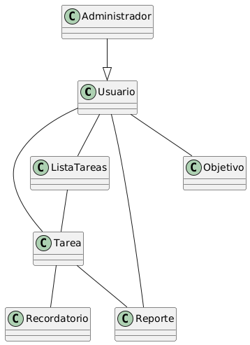

# Ejercicio 5: Aplicación de Gestión de Tareas “TaskMaster”

## Descripción del Proyecto

El proyecto busca desarrollar una aplicación digital diseñada para ayudar a los usuarios a organizar y gestionar sus actividades personales y profesionales mediante la creación de listas de tareas. La herramienta permitirá establecer prioridades, categorizar tareas, programar recordatorios y dar seguimiento al cumplimiento de objetivos diarios, semanales o mensuales.
El propósito central es mejorar la productividad y la organización de los usuarios, brindándoles un sistema intuitivo y accesible que combine simplicidad con funciones avanzadas de recordatorio y categorización.

## Modelo del dominio

